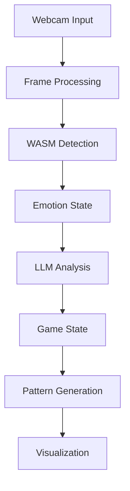
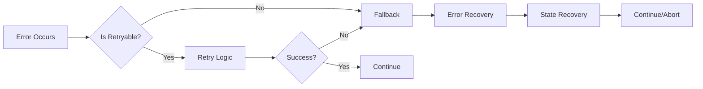
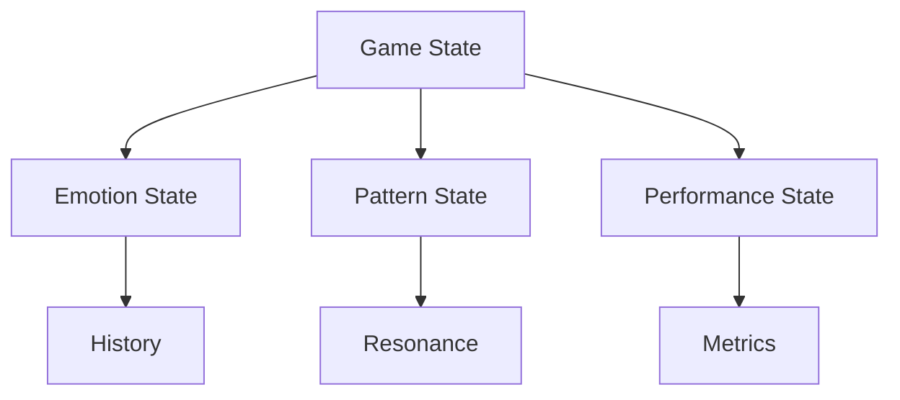

# Music Puzzle Game 🎵🧩

An innovative musical puzzle game that combines emotion detection, pattern recognition, and adaptive learning to create a unique gaming experience. Built with Rust and WebAssembly for optimal performance.
If you are asking "why is this here? what is going on?? who are you??? who am i??? when am we?" and so on, then let me tell you, I am simply throwing sphaghetti at a brick wall and seeing what patterns pop out.  What does _that_ mean?  Garbonzo.

## System Architecture

### Core Pipeline


### Error Handling Flow


### State Management


## Core Architecture

### Emotion Detection System
- Real-time emotion detection using webcam input
- Dual implementation in JavaScript and Rust
- Emotion history tracking and confidence scoring
- Adaptive response based on emotional stability
- Type-safe error handling and telemetry

### Pattern Generation
- Harmonic, rhythmic, and spatial pattern generation
- Resonance relationships between notes
- Dynamic pattern evolution and transformation
- LLM-powered pattern generation with fallback mechanisms

### Game Mechanics
- Adaptive difficulty based on player emotional state
- Dynamic monster behavior adjustments
- Emotional state affects monster aggression, speed, and health
- Learning rate adaptation based on player engagement

### Technical Implementation

#### Core Components
- **Frontend**: React, TypeScript, WebAssembly
- **Core Logic**: Rust
- **Package Manager**: Bun
- **Audio Processing**: Web Audio API
- **Machine Learning**: ONNX Runtime, Custom Neural Networks
- **Emotion Detection**: Face-API.js (Rust port)

#### Error Handling & Telemetry
- Centralized telemetry service with remote logging
- Type-safe error propagation
- Resource cleanup and state management
- Performance monitoring and debugging
- Fallback mechanisms for service degradation

#### Development Status

##### Completed Features ✅
- WASM integration with proper error handling
- Telemetry system with remote logging
- Type-safe LLM integration with fallbacks
- Resource cleanup and state management
- Performance monitoring and debugging

##### In Progress 🚧
- GPU-accelerated emotion detection
- Advanced pattern generation using LLMs
- Multiplayer support
- Mobile support
- VR/AR integration

## Development Setup

### Prerequisites
- [Rust](https://rustup.rs/) (stable toolchain)
- [Bun](https://bun.sh/) (latest version)
- [wasm-pack](https://rustwasm.github.io/wasm-pack/installer/)

### Installation
```bash
# Clone the repository
git clone https://github.com/yourusername/music-puzzle.git
cd music-puzzle

# Install dependencies
bun install
cd puzzle-web
bun install

# Build the WASM module
wasm-pack build puzzle-core --target web --out-dir ../puzzle-web/src/wasm
```

### Development Commands
```bash
# Run tests
bun test

# Run tests in watch mode
bun test --watch

# Run tests with coverage
bun test --coverage

# Type checking
bun run typecheck

# Linting
bun run lint

# Build the web app
bun run build
```

## Contributing

We welcome contributions! Please see our [Contributing Guidelines](CONTRIBUTING.md) for more information.

## License

This project is licensed under the MIT License - see the [LICENSE](LICENSE) file for details.

## Acknowledgments

- [Face-API.js](https://github.com/justadudewhohacks/face-api.js) for emotion detection
- [ONNX Runtime](https://github.com/microsoft/onnxruntime) for model inference
- [Rust WebAssembly](https://rustwasm.github.io/) for performance optimization
- [Bun](https://bun.sh/) for fast JavaScript runtime and package management

---

*Your support helps us push the boundaries of what's possible in educational gaming. Together, we can create something truly extraordinary.*
