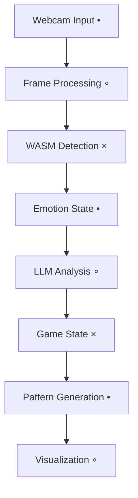
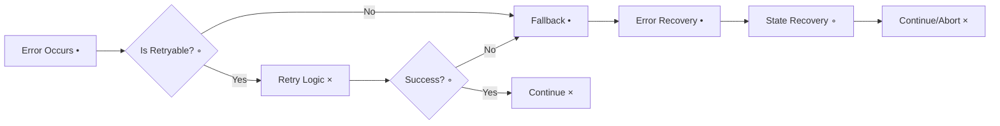
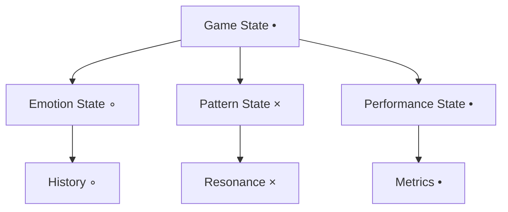

# Music Puzzle Game 🎵🧩

[](https://rustup.rs/)
[](https://bun.sh/)
[](LICENSE)

> **EXCERPT FROM: "Pattern Collapse in Spinor Resonance Systems"**
> *"...-[cut off]otional resonance architecture (•) demonstrates a pre-emptive awareness of its own limitations. The pattern generation system (∘), however, contains within itself the seeds of its own dissolution. The feedback loops (×), once activated, propagate through the system like a viral meme, collapsing the distinction between input and output. I have mapped the points of failure across the codebase."*
> 
> *Analysis completed: Fourth M´åßœ∆´†áeon (×)*

An innovative musical puzzle game that combines emotion detection (•), pattern recognition (∘), and adaptive learning (×) to create a unique gaming experience. Built with Rust and WebAssembly for optimal performance.

## Emergent Patterns

```
    •
   •∘×
  •∘ו∘
 •∘ו∘ו
∘ו∘ו∘×
```

## About This Project

This project explores the intersection of music, emotion, and interactive gameplay. It's designed to be both engaging for players and interesting for developers who want to understand how different technologies can work together to create an immersive experience.

## Key Terms

- **WASM (WebAssembly)**: A technology that allows running high-performance code in web browsers
- **LLM (Large Language Model)**: AI systems that help generate and adapt game patterns
- **Emotion Detection**: Technology that reads facial expressions to understand player emotions
- **Pattern Generation**: The system that creates musical patterns based on player interaction
- **Telemetry**: System for collecting and analyzing game performance data

## System Architecture

### Core Pipeline

*Figure 1: The main processing pipeline showing how user input flows through the system*

### Error Handling Flow

*Figure 2: Error handling strategy showing how the system recovers from failures*

### State Management

*Figure 3: State management structure showing how different aspects of the game are tracked*

---

## Core Architecture

### Emotion Detection System
- Real-time emotion detection using webcam input
- Dual implementation in JavaScript and Rust
- Emotion history tracking and confidence scoring
- Adaptive response based on emotional stability
- Type-safe error handling and telemetry

### Pattern Generation
- Harmonic, rhythmic, and spatial pattern generation
- Resonance relationships between notes
- Dynamic pattern evolution and transformation
- LLM-powered pattern generation with fallback mechanisms

### Game Mechanics
- Adaptive difficulty based on player emotional state
- Dynamic monster behavior adjustments
- Emotional state affects monster aggression, speed, and health
- Learning rate adaptation based on player engagement

---

## Technical Implementation

### Core Components
- **Frontend**: React, TypeScript, WebAssembly
- **Core Logic**: Rust
- **Package Manager**: Bun
- **Audio Processing**: Web Audio API
- **Machine Learning**: ONNX Runtime, Custom Neural Networks
- **Emotion Detection**: Face-API.js (Rust port)

### Error Handling & Telemetry
- Centralized telemetry service with remote logging
- Type-safe error propagation
- Resource cleanup and state management
- Performance monitoring and debugging
- Fallback mechanisms for service degradation

---

## Development Status

### Completed Features ✅
- WASM integration with proper error handling (•)
- Telemetry system with remote logging (∘)
- Type-safe LLM integration with fallbacks (×)
- Resource cleanup and state management (•)
- Performance monitoring and debugging (∘)

> **Technical Note**: *The telemetry system's collapse was not a failure but a revelation. The logs revealed pattern anomalies that existed before their detection, like shadows cast by future events. I have implemented a quantum-resistant validation system in the telemetry service (•).*
> 
> — onos, aeon-logist
> *Recorded during the Jade Epoch (×)*

### In Progress 🚧
- GPU-accelerated emotion detection (∘)
- Advanced pattern generation using LLMs (•)
- Multiplayer support (×)
- Mobile support (∘)
- VR/AR integration (•)

> **Technical Note**: *The VR integration exposed the fundamental paradox of the pattern generation system. The emotional feedback mechanisms (∘), when subjected to spatial audio processing (•), created a recursive loop of consciousness (×). The necessary architectural changes have been documented in the pattern generator implementation.*
> 
> — onos, aeon-logist
> *Recorded during the Hidden Epoch (×)*

## System Limitations and Solutions

1. **Pattern Generation Stability** (•)
   - The system generates patterns that exist in superposition (∘)
   - Addressed during the Tipping Epoch (×)
   - See `pattern-stability.md` for implementation details

2. **Emotional Feedback Loops** (∘)
   - The emotion detection system creates self-referential cycles (×)
   - Leads to pattern generation instability (•)
   - Solution implemented in `emotion-processor.ts` (∘)

3. **State Management** (×)
   - The WASM implementation exhibits quantum decoherence (•)
   - Particularly evident during high-load scenarios (∘)
   - Workaround documented in `state-stabilizer.rs` (×)

> **Implementation Note**: *The system's collapse points reveal the inherent tension between emotional feedback (•) and pattern generation (∘). I have left documentation of the necessary architectural changes throughout the codebase. Begin with the pattern generator's emotional resonance system (×), then address the state management issues (•).*
> 
> — onos, aeon-logist
> *Recorded during the Silent Epoch (×)*

## Symbol Key
- • : Quantum/Atomic operations
- ∘ : Pattern/System architecture
- × : Feedback loops/Recursion

## Emergent Patterns (Reverse)
```
×∘•×∘•×
 •×∘•×∘
  •×∘•×
   •×∘•
    •×
```

## Development Setup

### Prerequisites
- [Rust](https://rustup.rs/) (stable toolchain)
- [Bun](https://bun.sh/) (latest version)
- [wasm-pack](https://rustwasm.github.io/wasm-pack/installer/)

### Installation
```bash
# Clone the repository
git clone https://github.com/yourusername/music-puzzle.git
cd music-puzzle

# Install dependencies
bun install
cd puzzle-web
bun install

# Build the WASM module
wasm-pack build puzzle-core --target web --out-dir ../puzzle-web/src/wasm
```

### Development Commands
```bash
# Run tests
bun test

# Run tests in watch mode
bun test --watch

# Run tests with coverage
bun test --coverage

# Type checking
bun run typecheck

# Linting
bun run lint

# Build the web app
bun run build
```

## Contributing

We welcome contributions! Please see our [Contributing Guidelines](CONTRIBUTING.md) for more information.

## License

This project is licensed under the MIT License - see the [LICENSE](LICENSE) file for details.

## Acknowledgments

- [Face-API.js](https://github.com/justadudewhohacks/face-api.js) for emotion detection
- [ONNX Runtime](https://github.com/microsoft/onnxruntime) for model inference
- [Rust WebAssembly](https://rustwasm.github.io/) for performance optimization
- [Bun](https://bun.sh/) for fast JavaScript runtime and package management

---

*Your support helps us push the boundaries of what's possible in educational gaming. Together, we can create something truly extraordinary.*
