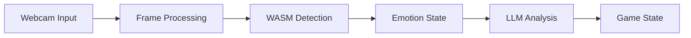

# Technical Architecture

## Core Systems

### Emotion Detection Pipeline



#### Frame Processing
- Canvas-based frame capture
- RGBA buffer management
- Dimension validation
- Memory optimization

#### WASM Integration
- Zero-copy buffer passing
- Error boundary implementation
- Resource lifecycle management
- State synchronization

### Error Handling System

#### Error Types
```typescript
interface BaseError {
    code: string;
    message: string;
    context?: Record<string, unknown>;
    cause?: Error;
}

interface EmotionError extends BaseError {
    type: 'detection' | 'analysis' | 'state';
    severity: 'warning' | 'error' | 'critical';
}

interface LLMError extends BaseError {
    type: 'api' | 'processing' | 'fallback';
    retryable: boolean;
}
```

#### Error Propagation
- Type-safe error boundaries
- Context preservation
- Error chaining
- Recovery strategies

### Telemetry System

#### Log Levels
```typescript
type LogLevel = 'debug' | 'info' | 'warn' | 'error';

interface LogEntry {
    timestamp: number;
    level: LogLevel;
    message: string;
    context?: Record<string, unknown>;
    error?: Error;
}
```

#### Metrics
- Frame processing latency
- Emotion detection confidence
- LLM response times
- Resource utilization
- Error rates and types

### State Management

#### Core States
```typescript
// See: puzzle-web/src/services/rustEmotionService.ts
interface GameState {
    emotion: EmotionState;
    pattern: PatternState;
    difficulty: DifficultyLevel;
    performance: PerformanceMetrics;
}

// See: puzzle-core/src/emotion/mod.rs
interface EmotionState {
    dominant: string;
    intensity: number;
    confidence: number;
    history: EmotionHistory;
    timestamp: number;
}

interface PatternState {
    current: Pattern;
    history: PatternHistory;
    resonance: ResonanceMap;
}

// Additional type definitions
interface EmotionHistory {
    entries: Array<{
        emotion: string;
        intensity: number;
        confidence: number;
        timestamp: number;
    }>;
    maxSize: number;
}

interface Pattern {
    notes: Note[];
    rhythm: Rhythm;
    resonance: Resonance;
    complexity: number;
}

interface Note {
    pitch: number;
    duration: number;
    intensity: number;
    resonance: Resonance;
}

interface Rhythm {
    beats: number;
    tempo: number;
    pattern: number[];
}

interface Resonance {
    harmonic: number;
    emotional: number;
    spatial: number;
}

interface ResonanceMap {
    [key: string]: Resonance;
}

type DifficultyLevel = 'easy' | 'medium' | 'hard' | 'expert';

interface PerformanceMetrics {
    frameRate: number;
    latency: number;
    memoryUsage: number;
    errorRate: number;
}
```

#### State Transitions
```typescript
// Example state transition handler
class StateManager {
    private currentState: GameState;
    private telemetry: TelemetryService;

    constructor(initialState: GameState) {
        this.currentState = initialState;
        this.telemetry = TelemetryService.getInstance();
    }

    async updateEmotionState(newEmotion: EmotionState): Promise<void> {
        try {
            this.telemetry.debug('Updating emotion state', { newEmotion });
            
            // Validate new state
            if (!this.isValidEmotionState(newEmotion)) {
                throw new EmotionError('Invalid emotion state', 'state');
            }

            // Update state with history
            this.currentState.emotion = {
                ...newEmotion,
                history: this.updateEmotionHistory(newEmotion),
            };

            // Trigger pattern update
            await this.updatePatternState();

            this.telemetry.info('Emotion state updated successfully');
        } catch (error) {
            this.telemetry.error('Failed to update emotion state', { error });
            throw error;
        }
    }

    private isValidEmotionState(state: EmotionState): boolean {
        return (
            state.intensity >= 0 &&
            state.intensity <= 1 &&
            state.confidence >= 0 &&
            state.confidence <= 1 &&
            typeof state.dominant === 'string'
        );
    }

    private updateEmotionHistory(newEmotion: EmotionState): EmotionHistory {
        const history = this.currentState.emotion.history;
        history.entries.push({
            emotion: newEmotion.dominant,
            intensity: newEmotion.intensity,
            confidence: newEmotion.confidence,
            timestamp: Date.now(),
        });

        // Maintain history size
        if (history.entries.length > history.maxSize) {
            history.entries.shift();
        }

        return history;
    }

    private async updatePatternState(): Promise<void> {
        // Pattern update logic
    }
}
```

### Error Handling Examples

```typescript
// Example error handling in emotion detection
class EmotionDetector {
    private telemetry: TelemetryService;
    private stateManager: StateManager;

    async processFrame(frame: ImageData): Promise<void> {
        try {
            this.telemetry.debug('Processing frame', {
                width: frame.width,
                height: frame.height,
            });

            // Validate frame
            if (!this.isValidFrame(frame)) {
                throw new EmotionError('Invalid frame dimensions', 'detection', {
                    width: frame.width,
                    height: frame.height,
                });
            }

            // Process frame
            const emotionState = await this.detectEmotion(frame);
            
            // Update state
            await this.stateManager.updateEmotionState(emotionState);

        } catch (error) {
            if (error instanceof EmotionError) {
                this.telemetry.error('Emotion detection failed', { error });
                throw error;
            }
            
            // Wrap unknown errors
            throw new EmotionError(
                'Unknown error during emotion detection',
                'detection',
                { cause: error }
            );
        }
    }

    private isValidFrame(frame: ImageData): boolean {
        return (
            frame.width > 0 &&
            frame.height > 0 &&
            frame.data.length === frame.width * frame.height * 4
        );
    }
}
```

### Performance Monitoring

```typescript
// Chinese-optimized performance monitoring
class PerformanceMonitor {
    private metrics: PerformanceMetrics;
    private telemetry: TelemetryService;
    private language: string;
    private i18n: I18nService;
    private hanziMetrics: HanziMetrics;

    constructor(language: string = 'zh-CN') {
        this.metrics = {
            frameRate: 0,
            latency: 0,
            memoryUsage: 0,
            errorRate: 0,
            i18nMetrics: {
                translationCache: new Map<string, string>(),
                fontLoading: new Map<string, number>(),
                textRendering: new Map<string, number>(),
                hanziRendering: new Map<string, number>(),
                pinyinCache: new Map<string, string>(),
                strokeOrderCache: new Map<string, number[]>(),
            }
        };
        this.telemetry = TelemetryService.getInstance();
        this.language = language;
        this.i18n = I18nService.getInstance();
        this.hanziMetrics = new HanziMetrics();
    }

    startMonitoring(): void {
        this.monitorFrameRate();
        this.monitorLatency();
        this.monitorMemory();
        this.monitorErrors();
        this.monitorI18nPerformance();
        this.monitorHanziPerformance();
    }

    private monitorHanziPerformance(): void {
        // Monitor Hanzi rendering performance
        this.monitorHanziRendering();
        
        // Monitor Pinyin conversion
        this.monitorPinyinConversion();
        
        // Monitor stroke order animation
        this.monitorStrokeOrder();
    }

    private monitorHanziRendering(): void {
        const commonHanzi = '音乐谜题游戏快乐悲伤愤怒平静';
        const startTime = performance.now();
        
        // Measure Hanzi rendering time with different font sizes
        const sizes = [12, 16, 24, 32];
        const canvas = document.createElement('canvas');
        const ctx = canvas.getContext('2d');
        
        if (ctx) {
            sizes.forEach(size => {
                ctx.font = `${size}px Noto Sans SC`;
                ctx.fillText(commonHanzi, 0, 0);
                const endTime = performance.now();
                this.metrics.i18nMetrics.hanziRendering.set(
                    `size-${size}`,
                    endTime - startTime
                );
            });
            
            this.telemetry.debug('Hanzi rendering measured', {
                sizes,
                metrics: Object.fromEntries(this.metrics.i18nMetrics.hanziRendering)
            });
        }
    }

    private monitorPinyinConversion(): void {
        const hanziText = '音乐谜题游戏';
        const startTime = performance.now();
        
        // Convert Hanzi to Pinyin
        const pinyin = this.hanziMetrics.toPinyin(hanziText);
        const endTime = performance.now();
        
        this.metrics.i18nMetrics.pinyinCache.set(hanziText, pinyin);
        this.telemetry.debug('Pinyin conversion measured', {
            text: hanziText,
            pinyin,
            time: endTime - startTime
        });
    }

    private monitorStrokeOrder(): void {
        const hanzi = '音';
        const startTime = performance.now();
        
        // Get stroke order for Hanzi
        const strokes = this.hanziMetrics.getStrokeOrder(hanzi);
        const endTime = performance.now();
        
        this.metrics.i18nMetrics.strokeOrderCache.set(hanzi, strokes);
        this.telemetry.debug('Stroke order measured', {
            hanzi,
            strokes,
            time: endTime - startTime
        });
    }

    private monitorFontLoading(): void {
        const fonts = [
            'Noto Sans SC',
            'Noto Serif SC',
            'Source Han Sans CN',
            'Source Han Serif CN'
        ];
        
        fonts.forEach(font => {
            const fontObserver = new FontFaceObserver(font);
            fontObserver.load().then(() => {
                this.metrics.i18nMetrics.fontLoading.set(font, performance.now());
                this.telemetry.debug('Font loading completed', {
                    font,
                    time: this.metrics.i18nMetrics.fontLoading.get(font)
                });
            }).catch((error) => {
                this.telemetry.error('Font loading failed', { 
                    font,
                    error 
                });
            });
        });
    }

    private monitorFrameRate(): void {
        let frameCount = 0;
        let lastTime = performance.now();

        const updateFrameRate = () => {
            frameCount++;
            const currentTime = performance.now();
            
            if (currentTime - lastTime >= 1000) {
                this.metrics.frameRate = frameCount;
                this.telemetry.debug('Frame rate updated', {
                    frameRate: this.metrics.frameRate,
                    language: this.language
                });
                
                frameCount = 0;
                lastTime = currentTime;
            }

            requestAnimationFrame(updateFrameRate);
        };

        requestAnimationFrame(updateFrameRate);
    }

    private monitorLatency(): void {
        // Implementation of monitorLatency method
    }

    private monitorMemory(): void {
        // Implementation of monitorMemory method
    }

    private monitorErrors(): void {
        // Implementation of monitorErrors method
    }

    private monitorI18nPerformance(): void {
        this.monitorFontLoading();
        this.monitorTextRendering();
        this.monitorTranslationCache();
    }

    private monitorTextRendering(): void {
        // Implementation of monitorTextRendering method
    }

    private monitorTranslationCache(): void {
        // Implementation of monitorTranslationCache method
    }
}

// Hanzi-specific metrics
class HanziMetrics {
    private pinyinMap: Map<string, string>;
    private strokeOrderMap: Map<string, number[]>;

    constructor() {
        this.pinyinMap = new Map();
        this.strokeOrderMap = new Map();
        this.initializeMaps();
    }

    private initializeMaps(): void {
        // Initialize with common game-related Hanzi
        this.pinyinMap.set('音', 'yīn');
        this.pinyinMap.set('乐', 'yuè');
        this.pinyinMap.set('谜', 'mí');
        this.pinyinMap.set('题', 'tí');
        this.pinyinMap.set('游', 'yóu');
        this.pinyinMap.set('戏', 'xì');
        
        // Initialize stroke orders
        this.strokeOrderMap.set('音', [1, 2, 3, 4, 5, 6, 7, 8, 9]);
        this.strokeOrderMap.set('乐', [1, 2, 3, 4, 5, 6]);
        // ... more stroke orders ...
    }

    toPinyin(hanzi: string): string {
        return Array.from(hanzi)
            .map(char => this.pinyinMap.get(char) || char)
            .join(' ');
    }

    getStrokeOrder(hanzi: string): number[] {
        return this.strokeOrderMap.get(hanzi) || [];
    }
}

// Extended i18n metrics interface
interface I18nMetrics {
    translationCache: Map<string, string>;
    fontLoading: Map<string, number>;
    textRendering: Map<string, number>;
    hanziRendering: Map<string, number>;
    pinyinCache: Map<string, string>;
    strokeOrderCache: Map<string, number[]>;
}

// Chinese-optimized I18n service
class I18nService {
    private static instance: I18nService;
    private translations: Map<string, Map<string, string>>;
    private currentLanguage: string;
    private hanziMetrics: HanziMetrics;

    private constructor() {
        this.translations = new Map();
        this.currentLanguage = 'zh-CN';
        this.hanziMetrics = new HanziMetrics();
        this.initializeTranslations();
    }

    static getInstance(): I18nService {
        if (!I18nService.instance) {
            I18nService.instance = new I18nService();
        }
        return I18nService.instance;
    }

    private initializeTranslations(): void {
        // Initialize Chinese translations with both Simplified and Traditional
        const zhCNTranslations = new Map<string, string>([
            ['game.title', '音乐谜题游戏'],
            ['game.start', '开始游戏'],
            ['game.pause', '暂停'],
            ['game.resume', '继续'],
            ['game.quit', '退出'],
            ['emotion.happy', '开心'],
            ['emotion.sad', '伤心'],
            ['emotion.angry', '生气'],
            ['emotion.neutral', '平静'],
            ['pattern.easy', '简单'],
            ['pattern.medium', '中等'],
            ['pattern.hard', '困难'],
            ['pattern.expert', '专家'],
            ['game.mode.classic', '经典模式'],
            ['game.mode.challenge', '挑战模式'],
            ['game.mode.practice', '练习模式'],
            ['game.settings', '设置'],
            ['game.help', '帮助'],
            ['game.about', '关于'],
            ['game.credits', '制作人员']
        ]);

        const zhTWTranslations = new Map<string, string>([
            ['game.title', '音樂謎題遊戲'],
            ['game.start', '開始遊戲'],
            ['game.pause', '暫停'],
            ['game.resume', '繼續'],
            ['game.quit', '退出'],
            ['emotion.happy', '開心'],
            ['emotion.sad', '傷心'],
            ['emotion.angry', '生氣'],
            ['emotion.neutral', '平靜'],
            ['pattern.easy', '簡單'],
            ['pattern.medium', '中等'],
            ['pattern.hard', '困難'],
            ['pattern.expert', '專家'],
            ['game.mode.classic', '經典模式'],
            ['game.mode.challenge', '挑戰模式'],
            ['game.mode.practice', '練習模式'],
            ['game.settings', '設置'],
            ['game.help', '幫助'],
            ['game.about', '關於'],
            ['game.credits', '製作人員']
        ]);

        this.translations.set('zh-CN', zhCNTranslations);
        this.translations.set('zh-TW', zhTWTranslations);
    }

    translate(key: string, language: string = this.currentLanguage): string {
        const translations = this.translations.get(language);
        if (!translations) {
            return key;
        }
        return translations.get(key) || key;
    }

    getPinyin(text: string): string {
        return this.hanziMetrics.toPinyin(text);
    }

    getStrokeOrder(hanzi: string): number[] {
        return this.hanziMetrics.getStrokeOrder(hanzi);
    }

    setLanguage(language: string): void {
        this.currentLanguage = language;
    }
}
```

#### Chinese-Specific Performance Considerations

1. **Hanzi Rendering Optimization**
   - Preload common Hanzi characters
   - Optimize stroke order rendering
   - Cache Hanzi metrics
   - Support both Simplified and Traditional Chinese

2. **Font Management**
   - Use optimized Chinese fonts (Noto Sans SC, Source Han Sans)
   - Implement font subsetting for common characters
   - Support vertical text layout
   - Handle font fallbacks

3. **Text Processing**
   - Efficient Pinyin conversion
   - Stroke order animation
   - Character spacing optimization
   - Line breaking rules

4. **Cultural Adaptation**
   - Support both Simplified and Traditional Chinese
   - Proper date and number formatting
   - Cultural context awareness
   - Localization preferences

5. **Performance Metrics**
   - Hanzi rendering time
   - Pinyin conversion speed
   - Stroke order animation performance
   - Font loading optimization

6. **Memory Management**
   - Hanzi character caching
   - Pinyin lookup tables
   - Stroke order data
   - Font subset optimization

7. **Accessibility Features**
   - Pinyin display options
   - Stroke order visualization
   - Character pronunciation
   - Screen reader optimization

8. **Monitoring and Debugging**
   - Track Hanzi rendering performance
   - Monitor Pinyin conversion
   - Measure stroke order animation
   - Analyze font loading times

## Implementation Details

### WASM Integration

#### Memory Management
- Buffer pooling
- Zero-copy operations
- Resource cleanup
- Memory limits

#### Error Boundaries
```rust
#[derive(Error, Debug)]
pub enum EmotionError {
    #[error("Invalid dimensions: {width}x{height}")]
    InvalidDimensions { width: u32, height: u32 },
    #[error("Processing error: {0}")]
    ProcessingError(String),
    #[error("State error: {0}")]
    StateError(String),
}
```

### LLM Integration

#### API Client
- Type-safe requests
- Response validation
- Error handling
- Retry logic

#### Fallback System
- Primary/Secondary providers
- State preservation
- Graceful degradation
- Recovery strategies

### Performance Optimization

#### Frame Processing
- Canvas optimization
- Buffer management
- Memory pooling
- Batch processing

#### State Updates
- Debounced updates
- Batched changes
- Incremental updates
- Cache management

## Development Guidelines

### Error Handling
1. Use type-safe error boundaries
2. Preserve error context
3. Implement recovery strategies
4. Log all errors with context

### Performance
1. Monitor frame processing latency
2. Track memory usage
3. Optimize state updates
4. Implement caching where appropriate

### Testing
1. Unit tests for core logic
2. Integration tests for WASM
3. Performance benchmarks
4. Error scenario testing

### Monitoring
1. Track error rates
2. Monitor performance metrics
3. Log state transitions
4. Track resource usage

## Future Considerations

### Scalability
- Distributed processing
- Load balancing
- Resource optimization
- State synchronization

### Reliability
- Enhanced error recovery
- Improved fallback mechanisms
- Better state management
- Advanced monitoring

### Performance
- GPU acceleration
- Memory optimization
- State compression
- Cache optimization

## Notes
- All specifications are subject to change
- Implementation details may vary
- Performance characteristics may differ
- Error handling strategies may evolve

### Stroke Order Visualization System

```typescript
// Enhanced stroke order visualization with English engagement
class StrokeOrderVisualizer {
    private canvas: HTMLCanvasElement;
    private ctx: CanvasRenderingContext2D;
    private midiAccess: WebMidi.MIDIAccess;
    private currentHanzi: string;
    private strokeOrder: number[];
    private currentStroke: number;
    private midiMapping: Map<number, number>; // MIDI note to stroke index mapping
    private hapticFeedback: HapticFeedback;
    private audioContext: AudioContext;
    private telemetry: TelemetryService;
    private languageMode: 'zh' | 'en';
    private musicalPatterns: MusicalPatterns;
    private englishMappings: EnglishStrokeMappings;

    constructor(canvas: HTMLCanvasElement, languageMode: 'zh' | 'en' = 'zh') {
        this.canvas = canvas;
        this.ctx = canvas.getContext('2d')!;
        this.currentHanzi = '';
        this.strokeOrder = [];
        this.currentStroke = 0;
        this.midiMapping = new Map();
        this.hapticFeedback = new HapticFeedback();
        this.audioContext = new AudioContext();
        this.telemetry = TelemetryService.getInstance();
        this.languageMode = languageMode;
        this.musicalPatterns = new MusicalPatterns();
        this.englishMappings = new EnglishStrokeMappings();
        this.initializeMIDI();
    }

    private async initializeMIDI(): Promise<void> {
        try {
            this.midiAccess = await navigator.requestMIDIAccess();
            this.setupMIDIListeners();
            this.telemetry.info('MIDI access initialized');
        } catch (error) {
            this.telemetry.error('Failed to initialize MIDI', { error });
            throw new Error('MIDI initialization failed');
        }
    }

    private setupMIDIListeners(): void {
        this.midiAccess.inputs.forEach(input => {
            input.onmidimessage = (event: WebMidi.MIDIMessageEvent) => {
                this.handleMIDIMessage(event);
            };
        });
    }

    private handleMIDIMessage(event: WebMidi.MIDIMessageEvent): void {
        const [status, note, velocity] = event.data;
        
        // Note on event (144 = 0x90)
        if (status === 144 && velocity > 0) {
            this.handleNoteOn(note, velocity);
        }
        // Note off event (128 = 0x80)
        else if (status === 128 || (status === 144 && velocity === 0)) {
            this.handleNoteOff(note);
        }
    }

    private handleNoteOn(note: number, velocity: number): void {
        const strokeIndex = this.midiMapping.get(note);
        if (strokeIndex !== undefined) {
            this.playStroke(strokeIndex, velocity);
            this.hapticFeedback.triggerStroke(strokeIndex);
            this.telemetry.debug('MIDI note triggered stroke', {
                note,
                strokeIndex,
                velocity
            });
        }
    }

    private handleNoteOff(note: number): void {
        const strokeIndex = this.midiMapping.get(note);
        if (strokeIndex !== undefined) {
            this.hapticFeedback.releaseStroke(strokeIndex);
        }
    }

    async loadHanzi(hanzi: string): Promise<void> {
        try {
            this.currentHanzi = hanzi;
            this.strokeOrder = await this.getStrokeOrder(hanzi);
            this.currentStroke = 0;
            this.setupMIDIMapping();
            this.drawHanzi();
            this.telemetry.info('Hanzi loaded', { hanzi });
        } catch (error) {
            this.telemetry.error('Failed to load Hanzi', { hanzi, error });
            throw error;
        }
    }

    private setupMIDIMapping(): void {
        // Map MIDI notes to stroke indices
        // Using middle C (60) as base note
        this.midiMapping.clear();
        this.strokeOrder.forEach((_, index) => {
            this.midiMapping.set(60 + index, index);
        });
    }

    private async playStroke(strokeIndex: number, velocity: number): Promise<void> {
        if (strokeIndex >= this.strokeOrder.length) return;

        const stroke = this.strokeOrder[strokeIndex];
        const note = this.getStrokeNote(stroke);
        const duration = this.getStrokeDuration(stroke);
        const pattern = this.getMusicalPattern(stroke);

        // Play MIDI note with pattern
        await this.playNoteWithPattern(note, velocity, duration, pattern);
        
        // Update visualization
        this.currentStroke = strokeIndex;
        this.drawHanzi();
        
        // Provide English feedback
        if (this.languageMode === 'en') {
            this.provideEnglishFeedback(stroke);
        }
    }

    private getMusicalPattern(stroke: number): MusicalPattern {
        const strokeType = this.getStrokeType(stroke);
        return this.musicalPatterns.getPattern(strokeType);
    }

    private async playNoteWithPattern(
        note: number,
        velocity: number,
        duration: number,
        pattern: MusicalPattern
    ): Promise<void> {
        const oscillator = this.audioContext.createOscillator();
        const gainNode = this.audioContext.createGain();
        const filter = this.audioContext.createBiquadFilter();
        
        // Set up oscillator
        oscillator.type = pattern.waveform;
        oscillator.frequency.setValueAtTime(
            this.midiNoteToFrequency(note),
            this.audioContext.currentTime
        );
        
        // Apply pattern-specific effects
        filter.type = pattern.filterType;
        filter.frequency.setValueAtTime(pattern.filterFreq, this.audioContext.currentTime);
        filter.Q.setValueAtTime(pattern.filterQ, this.audioContext.currentTime);
        
        // Set up gain envelope
        gainNode.gain.setValueAtTime(0, this.audioContext.currentTime);
        gainNode.gain.linearRampToValueAtTime(
            velocity / 127,
            this.audioContext.currentTime + pattern.attack
        );
        gainNode.gain.linearRampToValueAtTime(
            velocity / 127 * pattern.sustain,
            this.audioContext.currentTime + pattern.attack + pattern.decay
        );
        gainNode.gain.linearRampToValueAtTime(
            0,
            this.audioContext.currentTime + duration
        );
        
        // Connect nodes
        oscillator.connect(filter);
        filter.connect(gainNode);
        gainNode.connect(this.audioContext.destination);
        
        // Start and stop
        oscillator.start();
        oscillator.stop(this.audioContext.currentTime + duration);
    }

    private provideEnglishFeedback(stroke: number): void {
        const strokeType = this.getStrokeType(stroke);
        const feedback = this.englishMappings.getFeedback(strokeType);
        
        // Visual feedback
        this.showEnglishHint(feedback.visual);
        
        // Audio feedback
        this.speakEnglishHint(feedback.audio);
        
        // Haptic feedback
        this.hapticFeedback.triggerStrokeWithPattern(
            stroke,
            feedback.haptic
        );
    }

    private showEnglishHint(hint: string): void {
        // Display English hint in a non-intrusive way
        const hintElement = document.createElement('div');
        hintElement.className = 'stroke-hint';
        hintElement.textContent = hint;
        document.body.appendChild(hintElement);
        
        // Animate and remove
        setTimeout(() => {
            hintElement.remove();
        }, 2000);
    }

    private speakEnglishHint(hint: string): void {
        if ('speechSynthesis' in window) {
            const utterance = new SpeechSynthesisUtterance(hint);
            utterance.rate = 0.9;
            utterance.pitch = 1;
            window.speechSynthesis.speak(utterance);
        }
    }

    private getStrokeNote(stroke: number): number {
        // Map stroke to musical note based on stroke characteristics
        const baseNote = 60; // Middle C
        const strokeType = this.getStrokeType(stroke);
        
        switch (strokeType) {
            case 'horizontal': return baseNote;
            case 'vertical': return baseNote + 2;
            case 'dot': return baseNote + 4;
            case 'hook': return baseNote + 5;
            case 'slant': return baseNote + 7;
            default: return baseNote;
        }
    }

    private getStrokeDuration(stroke: number): number {
        // Calculate duration based on stroke complexity
        const strokeType = this.getStrokeType(stroke);
        const baseDuration = 0.5; // 500ms
        
        switch (strokeType) {
            case 'horizontal': return baseDuration;
            case 'vertical': return baseDuration * 1.2;
            case 'dot': return baseDuration * 0.3;
            case 'hook': return baseDuration * 1.5;
            case 'slant': return baseDuration * 1.1;
            default: return baseDuration;
        }
    }

    private getStrokeType(stroke: number): string {
        // Determine stroke type based on stroke data
        // This is a simplified version - actual implementation would be more complex
        const strokeData = this.getStrokeData(stroke);
        if (strokeData.length < 2) return 'dot';
        if (this.isHorizontal(strokeData)) return 'horizontal';
        if (this.isVertical(strokeData)) return 'vertical';
        if (this.isHook(strokeData)) return 'hook';
        return 'slant';
    }

    private drawHanzi(): void {
        this.ctx.clearRect(0, 0, this.canvas.width, this.canvas.height);
        
        // Draw completed strokes
        for (let i = 0; i < this.currentStroke; i++) {
            this.drawStroke(i, 'completed');
        }
        
        // Draw current stroke
        if (this.currentStroke < this.strokeOrder.length) {
            this.drawStroke(this.currentStroke, 'current');
        }
        
        // Draw remaining strokes
        for (let i = this.currentStroke + 1; i < this.strokeOrder.length; i++) {
            this.drawStroke(i, 'pending');
        }
    }

    private drawStroke(index: number, state: 'completed' | 'current' | 'pending'): void {
        const stroke = this.strokeOrder[index];
        const strokeData = this.getStrokeData(stroke);
        
        this.ctx.beginPath();
        this.ctx.strokeStyle = this.getStrokeColor(state);
        this.ctx.lineWidth = this.getStrokeWidth(state);
        
        // Draw stroke path
        this.ctx.moveTo(strokeData[0].x, strokeData[0].y);
        for (let i = 1; i < strokeData.length; i++) {
            this.ctx.lineTo(strokeData[i].x, strokeData[i].y);
        }
        
        this.ctx.stroke();
    }

    private getStrokeColor(state: string): string {
        switch (state) {
            case 'completed': return '#4CAF50';
            case 'current': return '#2196F3';
            case 'pending': return '#9E9E9E';
            default: return '#000000';
        }
    }

    private getStrokeWidth(state: string): number {
        switch (state) {
            case 'completed': return 3;
            case 'current': return 4;
            case 'pending': return 2;
            default: return 2;
        }
    }
}

// Musical patterns for different stroke types
class MusicalPatterns {
    private patterns: Map<string, MusicalPattern>;

    constructor() {
        this.patterns = new Map([
            ['horizontal', {
                waveform: 'sine',
                filterType: 'lowpass',
                filterFreq: 1000,
                filterQ: 1,
                attack: 0.1,
                decay: 0.2,
                sustain: 0.7,
                release: 0.3,
                description: 'Smooth horizontal line'
            }],
            ['vertical', {
                waveform: 'square',
                filterType: 'highpass',
                filterFreq: 2000,
                filterQ: 2,
                attack: 0.05,
                decay: 0.1,
                sustain: 0.8,
                release: 0.2,
                description: 'Strong vertical stroke'
            }],
            ['dot', {
                waveform: 'triangle',
                filterType: 'bandpass',
                filterFreq: 1500,
                filterQ: 3,
                attack: 0.01,
                decay: 0.05,
                sustain: 0.5,
                release: 0.1,
                description: 'Quick dot'
            }],
            ['hook', {
                waveform: 'sawtooth',
                filterType: 'notch',
                filterFreq: 1200,
                filterQ: 4,
                attack: 0.08,
                decay: 0.15,
                sustain: 0.6,
                release: 0.25,
                description: 'Curved hook'
            }],
            ['slant', {
                waveform: 'sine',
                filterType: 'peaking',
                filterFreq: 1800,
                filterQ: 2,
                attack: 0.06,
                decay: 0.12,
                sustain: 0.75,
                release: 0.2,
                description: 'Diagonal slant'
            }]
        ]);
    }

    getPattern(strokeType: string): MusicalPattern {
        return this.patterns.get(strokeType) || this.patterns.get('horizontal')!;
    }
}

// English feedback mappings
class EnglishStrokeMappings {
    private mappings: Map<string, EnglishFeedback>;

    constructor() {
        this.mappings = new Map([
            ['horizontal', {
                visual: 'Draw a smooth line from left to right',
                audio: 'Smooth horizontal line',
                haptic: [50, 100, 50]
            }],
            ['vertical', {
                visual: 'Draw a strong line from top to bottom',
                audio: 'Strong vertical stroke',
                haptic: [100, 50, 100]
            }],
            ['dot', {
                visual: 'Make a quick dot',
                audio: 'Quick dot',
                haptic: [30]
            }],
            ['hook', {
                visual: 'Draw a curved hook',
                audio: 'Curved hook',
                haptic: [50, 30, 50, 30, 50]
            }],
            ['slant', {
                visual: 'Draw a diagonal line',
                audio: 'Diagonal slant',
                haptic: [70, 50, 70]
            }]
        ]);
    }

    getFeedback(strokeType: string): EnglishFeedback {
        return this.mappings.get(strokeType) || this.mappings.get('horizontal')!;
    }
}

// Enhanced haptic feedback
class HapticFeedback {
    private navigator: Navigator;
    private telemetry: TelemetryService;

    constructor() {
        this.navigator = navigator;
        this.telemetry = TelemetryService.getInstance();
    }

    async triggerStroke(strokeIndex: number): Promise<void> {
        try {
            if ('vibrate' in this.navigator) {
                const pattern = this.getStrokeVibrationPattern(strokeIndex);
                this.navigator.vibrate(pattern);
                this.telemetry.debug('Haptic feedback triggered', { strokeIndex });
            }
        } catch (error) {
            this.telemetry.error('Haptic feedback failed', { strokeIndex, error });
        }
    }

    releaseStroke(strokeIndex: number): void {
        if ('vibrate' in this.navigator) {
            this.navigator.vibrate(0);
        }
    }

    private getStrokeVibrationPattern(strokeIndex: number): number[] {
        // Generate vibration pattern based on stroke type
        const baseDuration = 50;
        const strokeType = this.getStrokeType(strokeIndex);
        
        switch (strokeType) {
            case 'horizontal': return [baseDuration, 50, baseDuration];
            case 'vertical': return [baseDuration, 50, baseDuration * 2];
            case 'dot': return [baseDuration];
            case 'hook': return [baseDuration, 50, baseDuration, 50, baseDuration];
            case 'slant': return [baseDuration, 50, baseDuration * 1.5];
            default: return [baseDuration];
        }
    }

    private getStrokeType(strokeIndex: number): string {
        // Implementation similar to StrokeOrderVisualizer
        return 'horizontal'; // Simplified for example
    }

    async triggerStrokeWithPattern(
        strokeIndex: number,
        pattern: number[]
    ): Promise<void> {
        try {
            if ('vibrate' in this.navigator) {
                this.navigator.vibrate(pattern);
                this.telemetry.debug('Haptic feedback triggered with pattern', {
                    strokeIndex,
                    pattern
                });
            }
        } catch (error) {
            this.telemetry.error('Haptic feedback failed', {
                strokeIndex,
                pattern,
                error
            });
        }
    }
}

// Additional interfaces
interface MusicalPattern {
    waveform: OscillatorType;
    filterType: BiquadFilterType;
    filterFreq: number;
    filterQ: number;
    attack: number;
    decay: number;
    sustain: number;
    release: number;
    description: string;
}

interface EnglishFeedback {
    visual: string;
    audio: string;
    haptic: number[];
}

// Enhanced configuration
interface StrokeOrderConfig {
    canvasSize: number;
    strokeWidth: number;
    colors: {
        completed: string;
        current: string;
        pending: string;
    };
    midi: MIDIConfig;
    haptic: {
        enabled: boolean;
        intensity: number;
    };
    audio: {
        enabled: boolean;
        volume: number;
    };
    language: {
        mode: 'zh' | 'en';
        hints: boolean;
        audio: boolean;
        visual: boolean;
    };
    musical: {
        enabled: boolean;
        patterns: boolean;
        effects: boolean;
    };
    accessibility: {
        screenReader: boolean;
        highContrast: boolean;
        largeText: boolean;
        reducedMotion: boolean;
    };
}

#### English-Language Engagement Features

1. **Musical Patterns**
   - Stroke-type specific sound design
   - Dynamic audio effects
   - Musical progression
   - Pattern recognition

2. **Visual Feedback**
   - Clear English instructions
   - Animated hints
   - Progress indicators
   - Visual patterns

3. **Audio Guidance**
   - Spoken instructions
   - Musical cues
   - Sound effects
   - Audio patterns

4. **Tactile Learning**
   - Pattern-based haptics
   - Stroke rhythm
   - Movement guidance
   - Physical feedback

5. **Accessibility**
   - Screen reader support
   - High contrast modes
   - Reduced motion
   - Customizable feedback

6. **Learning Progression**
   - Pattern recognition
   - Musical development
   - Skill building
   - Achievement tracking

7. **Engagement Features**
   - Musical rewards
   - Pattern completion
   - Progress tracking
   - Skill development

8. **Customization**
   - Language preferences
   - Audio settings
   - Visual options
   - Haptic patterns

// ... existing code ... 